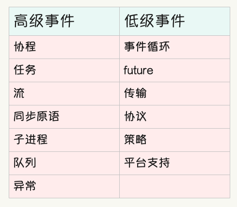
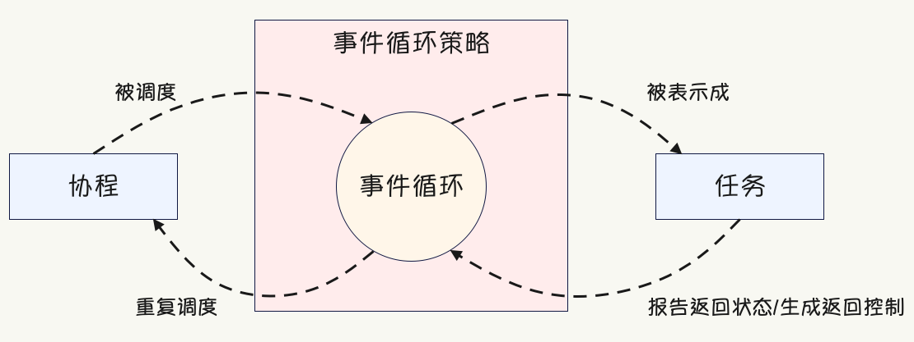
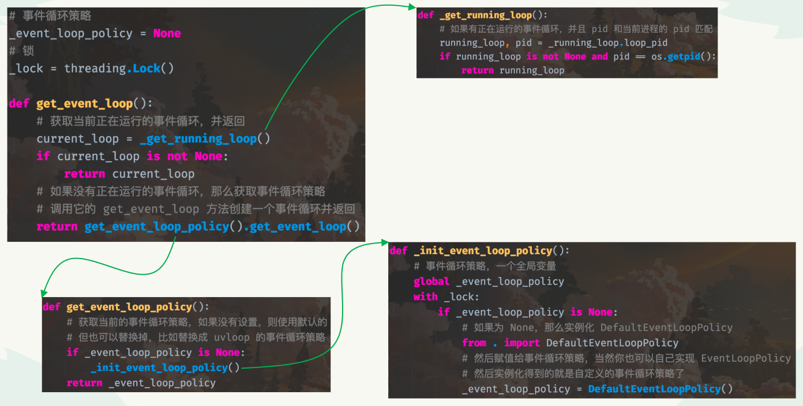
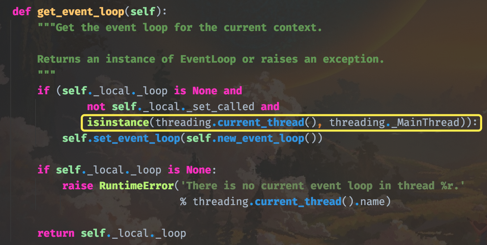
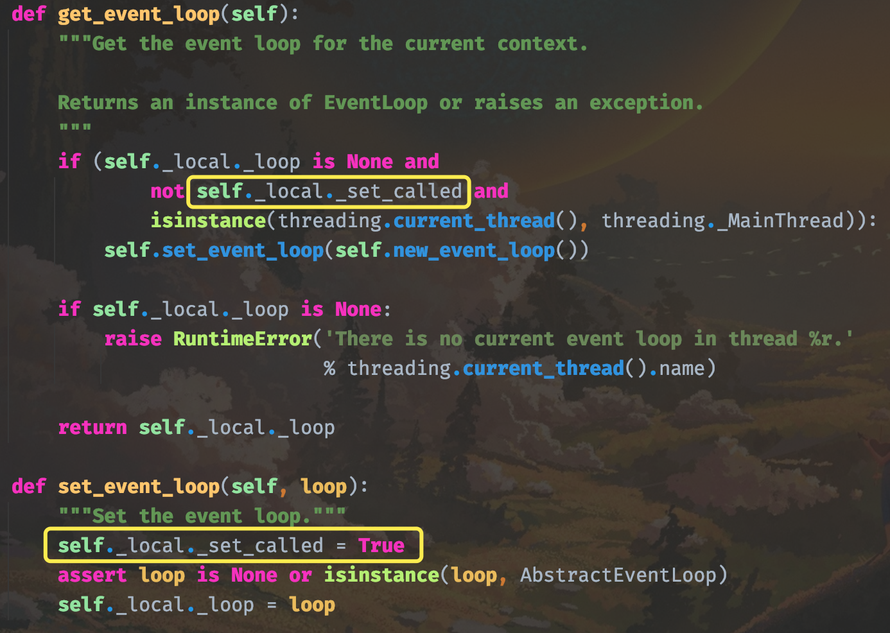

## 楔子

本次来聊一聊 asyncio，它是 Python 在 3.4 版本引入的标准库。asyncio 本质上是一个协同并发框架，是当前 Python 并发编程的主流，从 API 上大致可以分为高级 API 和低级 API 两类，如下图所示。

但在 Python3.7 的时候，对 asyncio 增加了大量可用性改造，比如 asyncio.run API，它抽象了对事件循环的访问，并将一些管理任务从开发人员那里抽象了出来。因此，大多数 API 都是与协程和任务相关的，除此之外本文还会介绍很多和新奇的 API，比如传输（transport）和协议（protocol）。

asyncio 一直被人诟病的地方就是比较难学，概念很多，这些概念分为低级和高级，而自底向上的方式更适合学习 asyncio。

因此事件循环处于事件循环策略上下文中，这是 asyncio 所持有的概念，因此本文采用的方法是先引入低级概念，如事件循环、事件循环策略和监视程序（watcher）等。然后再介绍协程的任务 API，它们抽象了异步工作单元（async working unit）。当然还有异步生成器和异步上下文管理器，以及若干个低级工具和对应的用例。

低级概念介绍完毕之后，再来介绍高级概念，比如：

+ 确保在同步时不会遇到竞争条件（race condition），Coffman 条件（竞争条件的必要条件、但不是充分条件）、asyncio 版本的锁和信号量以及在异步代码中如何显示竞争条件；
+ 让 asyncio 组件互相通信，包括如何实现传统的生产者-消费者模式，客户端-服务端模式等；
+ 改进 asyncio 应用程序，包括如何迁移到新的 Python API 版本以及如何检测废弃的 API；
+ 实现你自己的二进制协议和已有的协议，包括如何使用 asyncio 的强大协议和传输抽象；
+ 避免常见的错误，包括避免太长的阻塞代码，缺少一个 await 关键字等；

选择这种方式来介绍，可以让你更快速地理解 asyncio，而不需要为技术复杂性浪费太多时间。

## 什么是事件循环？如何使用它？

asyncio 框架使用事件循环来编排回调函数（callback）和异步任务（asynchronous task），事件循环位于事件循环策略的上下文中，协程、事件循环和策略之间的相互关系如下所示：

按照 Go 语言之父的说法，协程是一种轻量级的并发模型，这是从广义上来讲的。如果从狭义上来讲，协程就是一个可以暂停、后续还能从暂停处恢复执行的函数，至于在什么地方暂停，则通过专门语法标记进行确定。而协程不能直接运行，必须由事件循环负责驱动，而事件循环在驱动协程执行之前，会先将协程包装成任务。

任务对象可以跟踪协程的状态，并由相应的事件循环进行实例化，事件循环跟踪当前正在运行的任务，并将空闲协程的 CPU 时间片委托给处于挂起（pending）状态的协程。

### 定位当前运行的循环

由于各种原因，并发框架必须能够告诉你一个事件循环当前是否正在运行，以及它的获取方式。

~~~Python
import asyncio

# 方案一
loop = asyncio.get_event_loop()

# 方案二
try:
    loop = asyncio.get_running_loop()
except RuntimeError:
    print("没有事件循环在运行")
~~~

在 Python3.7 以后的版本中有两种方式来获取当前正在运行的事件循环实例，先来看看 asyncio.get_event_loop() 做了什么。

+ 1）检查在调用函数时是否有循环在运行；
+ 2）如果有，则返回其 pid 与当前进程 pid 匹配的运行循环；
+ 3）如果没有，获取存储在 asyncio 模块里的事件循环策略，以一个全局变量的形式存在；
+ 4）如果没有设置策略（为 None），则在加锁的情况下以 DefaultEventLoopPolicy 实例化它，需要注意：DefaultEventLoopPolicy 依赖于操作系统，它提供了一个默认的循环实现，称为 get_event_loop。所以通过调用事件循环策略的 get_event_loop 方法，即可创建一个事件循环实例。

注意：事件循环策略的 get_event_loop 方法只在主线程上实例化一个循环并分配给线程局部变量，如果你不在主线程上并且没有通过其它方法实例化正在运行的循环，那么它将引发一个 RuntimeError。所以：

+ get_event_loop 检查是否存在并返回当前运行的循环
+ 事件循环策略是全局存储的线程，而循环实例是本地的存储线程
+ 如果你在主线程上，那么 get_event_loop 将实例化该循环并在策略中本地保存实例线程
+ 如果你不在主线程上，它将引发一个 RuntimeError

我们看一下源代码。

所以 get_event_loop 的逻辑很简单，就是检测当前有没有正在运行的事件循环，有就返回，没有就创建一个。而创建事件循环需要先拿到事件循环策略，策略不为空，那么直接调用它的 get_event_loop 方法；策略为空，那么就实例化 DefaultEventLoopPolicy，创建一个策略，整个过程很好理解。

而 get_running_loop 就更简单了，它表示获取当前正在运行的事件循环。

~~~Python
def get_running_loop():
    loop = _get_running_loop()
    if loop is None:
        raise RuntimeError('no running event loop')
    return loop
~~~

通常来说，get_running_loop 应该放在协程里面调用。因为协程要想执行，需要由事件循环驱动，所以在执行 get_running_loop 的时候，事件循环已经创建好了。

### 创建新的循环实例

如果开启一个子线程，那么在子线程中调用 get_event_loop 是会报错的。

~~~Python
import asyncio
import threading

def create_loop():
    asyncio.get_event_loop()

threading.Thread(target=create_loop).start()
"""
RuntimeError: There is no current event loop in thread 'Thread-1'.
"""
~~~

这是啥原因呢？首先事件循环是通过调用事件循环策略的 get_event_loop 方法创建的，事件循环策略是通过实例化 DefaultEventLoopPolicy 得到的。

~~~Python
"""
我当前使用的系统是 macOS
不同的系统，DefaultEventLoopPolicy 对应的类不同，会根据操作系统选择一个合适的
"""
# asyncio/unix_events.py
DefaultEventLoopPolicy = _UnixDefaultEventLoopPolicy

class _UnixDefaultEventLoopPolicy(events.BaseDefaultEventLoopPolicy):
    ...

# asyncio/events.py
class BaseDefaultEventLoopPolicy(AbstractEventLoopPolicy):

    _loop_factory = None

    class _Local(threading.local):
        _loop = None
        _set_called = False

    def __init__(self):
        # 注意这里的 self._local 它是线程隔离的
        self._local = self._Local()

    def get_event_loop(self):
        # 调用策略的 get_event_loop 方法创建事件循环，严格意义上讲，应该是获取事件循环
        # 从源码中可以看到创建事件循环其实是通过 new_event_loop 实现的
        # 事件循环创建完毕之后，再通过 set_event_loop 设置在策略当中
        # 而创建循环是有条件的，除了循环不存在之外，还有一个就是当前所在线程必须是主线程
        if (self._local._loop is None and
                not self._local._set_called and
                isinstance(threading.current_thread(), threading._MainThread)):
            self.set_event_loop(self.new_event_loop())
        
        # 如果不是主线程，那么不会创建循环，然后 self._local 又是线程隔离的
        # 于是调用 get_event_loop 报错
        if self._local._loop is None:
            raise RuntimeError('There is no current event loop in thread %r.'
                               % threading.current_thread().name)

        return self._local._loop

    def set_event_loop(self, loop):
        # 设置事件循环，本质上就是 self._local 的一个属性
        self._local._set_called = True
        assert loop is None or isinstance(loop, AbstractEventLoop)
        self._local._loop = loop

    def new_event_loop(self):
        # 真正用来创建事件循环，创建完了还要通过 set_event_loop 设置进去
        # 不然无法通过 get_event_loop 获取
        return self._loop_factory()

~~~

当然啦，这几个方法也都在 asyncio 模块下以全局函数的形式存在。

如果我们想创建一个事件循环，也可以通过 asyncio.new_event_loop，或者通过 get_event_loop_policy().new_event_loop，两者是一样的。并且在刚才的源码中我们看到，get_event_loop_policy 在调用时，如果发现事件循环策略不为空，那么就不会再创建了（直接返回已存在的策略），否则才会实例化 DefaultEventLoopPolicy。这就说明，不管事件循环有多少个，但是策略只有一个，而这些循环都保存在策略的 _local 属性中。

所以策略的 _local 里面可以有很多事件循环，而通过 get_event_loop 获取事件循环，本质上就是通过 `策略._local._loop` 的方式获取。而不同的线程会获取不同的 \_loop，因为 \_local 里面保存了线程 ID 到事件循环的映射，会根据线程 ID 获取对应的事件循环。而 set_event_loop 的原理也很简单，就是将 new_event_loop 创建好的事件循环赋值给 `策略._local._loop` 。

~~~python
import asyncio
import threading

def create_loop():
    # 获取事件循环策略，如果没创建，那么就实例化 DefaultEventLoopPolicy 创建一个
    # 这个 DefaultEventLoopPolicy 也不是一个具体的类，而是根据操作系统对应不同的类
    loop_policy = asyncio.get_event_loop_policy()
    # 通过策略的 new_event_loop 方法创建事件循环
    loop = loop_policy.new_event_loop()
    # 但以上两步可以直接合成一步，通过 asyncio.new_event_loop

    # 设置循环，将循环设置在策略的 _local 中，这样才能通过 get_event_loop 获取
    asyncio.set_event_loop(loop)
    loop.close()

threading.Thread(target=create_loop).start()
threading.Thread(target=create_loop).start()
threading.Thread(target=create_loop).start()
~~~

以上我们就创建了 3 个事件循环，并保存在了策略的 \_local 属性下面。

> 总结：事件循环策略在整个进程内是单例的，所有的线程共享一个策略；事件循环在所在的线程内是单例的，一个线程内部只会有一个事件循环。所有线程对应的循环均位于策略的 \_local 属性中，获取的时候根据线程 ID 区分。
>
> + 策略的 new_event_loop 方法：创建事件循环；
>
> + 策略的 set_event_loop 方法：设置事件循环；
> + 策略的 get_event_loop 方法：获取事件循环，会先检测策略的 \_local 中是否有当前线程对应的事件循环，有则获取，没有则通过 new_event_loop 创建、set_event_loop 设置，然后返回；
>
> 但是 get_event_loop、set_event_loop、new_event_loop 我们一般不会手动通过策略去调用，而是会通过 asyncio 会去调用，比如 asyncio.get_event_loop。当然在 asyncio.get_event_loop 内部，也是先通过 get_event_loop_policy() 获取策略，然后调用策略的 get_event_loop 方法，获取线程对应的循环，两者本质是一样的，因为策略是单例的。

所以无论主线程还是子线程，毫无疑问都是可以创建事件循环的。只不过主线程既可以手动调用 new_event_loop 和 set_event_loop 来创建，也可以调用 get_event_loop（当循环不存在时内部自动创建）。但对于子线程而言，只能采用第一种方式，也就是手动创建，如果直接调用 get_event_loop 是会报错的，至于原因，源码中写的很清楚了。

当循环不存在时，必须是主线程才会自动创建，而子线程不会。所以结果就是因为循环为空，导致程序报错。

到目前为止，我们描述的有些啰嗦，但这些知识如果不掌握好的话，后面学起来会很费劲。所以只要能掌握它，我们还是愿意啰嗦一些的。

然后还要补充一点就是：对于新创建的事件循环，还要附加到事件循环策略监视器中，以确保我们的事件循环可以监视在 UNIX 系统上新生成的子进程的终止状态。

~~~Python
import asyncio
from asyncio import get_event_loop_policy
import platform

loop = asyncio.new_event_loop()
asyncio.set_event_loop(loop)

print(
    asyncio.get_event_loop() is loop is get_event_loop_policy()._local._loop
)  # True

if platform.system() != "Windows":
    watcher = asyncio.get_child_watcher()
    watcher.attach_loop(loop)
~~~

这个 get_child_watcher 用的不多，了解一下即可。

### 运行一个事件循环

回调函数和协程每次只能在预先设计好、并正在运行的事件循环上被调度。我们需要知道究竟该调用哪个循环 API，以便将事件循环状态机（state machine）转换为运行状态。我们还需要确定正确的位置来调度回调函数和协程。

~~~python
import asyncio
import platform

loop = asyncio.new_event_loop()
asyncio.set_event_loop(loop)

if platform.system() != "Windows":
    watcher = asyncio.get_child_watcher()
    watcher.attach_loop(loop)

# 使用 asyncio.ensure_future 调度第一个协程
# 或者使用 loop.call_soon 调度第一个同步回调函数
"""
try:
    loop.run_forever()
finally:
    loop.close()
"""
try:
    loop.run_until_complete(loop.shutdown_asyncgens())
finally:
    loop.close()
~~~

调用 loop.run_forever()，这个调用将处于阻塞状态，直到我们显式调用 loop.stop() 或出现异常时才会停止。也可以通过 loop.run_until_complete 来调度一个协程，这么做有一个好处，就是我们不必显式调用 loop.stop()，循环会一直运行直到传递给 run_until_complete 的协程执行结束后停止。

> loop.stop() 之后仍然可以调用 loop.run\_\* 方法，但 loop.close() 不行，它会直接关闭事件循环。

这里会有人好奇，那 loop.for_ever() 是干啥的，它都不能传递协程。很简单，任务可以先添加到事件循环中，然后通过 loop.for_ever() 启动事件循环，这样之前添加的任务会自动执行。如果希望停止事件循环，只需要在协程里面通过 loop.stop() 或 loop.close() 即可。

### 在不考虑事件循环的条件下运行异步代码

如果你不想花心思修改循环策略和清理异步生成器之后的代码，那么直接使用以下代码就可以了。如果你只有一个线程和进程并且只有一个需要从头到尾保持运行的协程，那么也可以用这种方法。

~~~Python
import asyncio

async def main():
    pass

asyncio.run(main())
~~~

如果你的设置非常简单，只想运行一个协程直到它完全处于被等待的状态，那么你可以使用 asyncio.run 这个 API。

> 推荐使用这种方式运行简单的或单线程异步应用程序。

我们看一下 asyncio.run 的源码：

~~~Python
def run(main, *, debug=None):
    
    if events._get_running_loop() is not None:
        raise RuntimeError(
            "asyncio.run() cannot be called from a running event loop")

    if not coroutines.iscoroutine(main):
        raise ValueError("a coroutine was expected, got {!r}".format(main))
    # 不管当前是否存在事件循环，都会创建一个新的事件循环
    loop = events.new_event_loop()
    try:
        # 并把之前的事件循环替换掉，因为一个线程只会有一个事件循环
        events.set_event_loop(loop)
        if debug is not None:
            loop.set_debug(debug)
        # 运行指定的协程
        return loop.run_until_complete(main)
    finally:
        try:
            _cancel_all_tasks(loop)
            # 将所有的异步生成器给清理掉
            loop.run_until_complete(loop.shutdown_asyncgens())
        finally:
            # 将事件循环替换为 None
            events.set_event_loop(None)
            # 关闭事件循环（不是停止、是关闭）
            loop.close()
~~~

这里面存在一个问题，就是使用 asyncio.run 之后，就不能再调用 get_event_loop 了。

~~~Python
import asyncio

async def main():
    pass

asyncio.run(main())
loop = asyncio.get_event_loop()
"""
RuntimeError: There is no current event loop in thread 'MainThread'.
"""
~~~

来解释一下原因，问题还是出现在 get_event_loop 里面。

策略的 \_local 属性里面除了有表示事件循环的 \_loop 之外，还有一个 \_set\_called，它表示该线程是否设置过事件循环。当调用 asyncio.run 的时候，将该字段设置成了 True，然后执行完毕把事件循环设置成 None 了，但 \_set\_called 却没有设置成 False。因此当我们再调用 get_event_loop 的时候，第一个 if 不满足，于是不会再创建事件循环了，但事件循环已经被设置为 None 了，于是第二个 if 条件满足，程序报错。

所以总结：asyncio.run 只适合一次性的简单任务。

> asyncio.run 是可以调用多次的，因为它每次都会创建新的循环。

### 在协程结束之后才运行一个事件循环

在一个协程结束之后继续运行另一个协程，是事件循环必须完成的最基本、也是最重要的任务之一。如果没有这个能力，事件循环将几乎毫无用处。这是因为没有任何信息可以表明你的负载被消耗了，因此你在代码中没有做假设的余地。

如果我们想要将协程的生命周期与循环耦合起来，那么可以采用两种方法。我们可以分配一个事件循环并在循环中调度协程（并且必须自己处理所有的清理操作），或者使用更高级的 API，比如 asyncio.run，它会自动清理并关闭事件循环。

~~~Python
import asyncio

async def main():
    pass

# 手动分配事件循环
loop = asyncio.get_event_loop()
try:
    # 在循环中调度协程
    loop.run_until_complete(main())
finally:
    try:
        # 当然清理工作还需要我们来做
        loop.run_until_complete(loop.shutdown_asyncgens())
    finally:
        # run_until_complete 运行结束后，循环会停止
        # 但我们要关闭它
        loop.close()
~~~

如果使用 asyncio.run，那么会创建两次事件循环，因为要连续运行两个协程。而上面这种方式，它只会创建一个事件循环，循环在驱动完 main() 执行之后，紧接着再驱动 loop.shutdown_asyncgens() 执行（清理那些未被完全消耗的异步生成器）。

或者使用最低级的 API asyncio.new_event_loop，它可以创建一个新的事件循环实例，同时遵守当前已安装的事件循环策略。不过使用它需要大量的手动操作，例如将循环附加到当前的子监视程序或清理异步生成器。所以只有在跨多个进程的更复杂设置中，或者为了更好地理解 asyncio 的底层原理时，才可能需要这样做。

~~~python
import asyncio
import platform

async def main():
    pass

# 或者 loop = asyncio.get_event_loop_policy().new_event_loop()
loop = asyncio.new_event_loop()
asyncio.set_event_loop(loop)

if platform.system() != "Windows":
    watcher = asyncio.get_child_watcher()
    watcher.attach_loop(loop)
    
try:
    loop.run_until_complete(main())
finally:
    try:
        loop.run_until_complete(loop.shutdown_asyncgens())
    finally:
        loop.close()
~~~

显然这有点像 asyncio.run 了。

### 在事件循环中调度回调函数

事件循环可以以面向回调函数的方式使用，也可以与协程一起使用。后者被认为是 asyncio 中的高级模式，但对于计时器或基于时间的状态机这样的用例，具有可延迟回调的回调 API 可以产生非常优雅和简洁的效果。

我们将学习如何使用 loop.call\_\* API 来调度事件循环上的同步回调函数。

~~~Python
import asyncio

loop = asyncio.get_event_loop()
loop.call_soon(print, "我是 call_soon")
loop.call_soon_threadsafe(print, "我是 call_soon，但线程安全")
loop.call_later(1, print, "我是 call_later")
loop.call_at(loop.time() + 1, print, "我是 call_at")

# 通过 loop.call_*，任务已经创建好了，我们只需要启动事件循环就会执行
try:
    loop.run_forever()
except KeyboardInterrupt:
    # 按下 Ctrl+C 暂停循环
    loop.stop()
finally:
    loop.close()
"""
我是 call_soon
我是 call_soon，但线程安全
我是 call_later
我是 call_at
"""
~~~

为了在事件循环上调用函数，我们有 4 中方法可供选择。

+ call_soon
+ call_soon_threadsafe
+ call_later
+ call_at

除了 loop.call soon threadsafe，其他 loop.call\_\* 方法都不是线程安全的。

所有这些方法都支持新的仅限关键字参数（keyword-only parameter）context，context 参数需要是 Context 的一个实例。Context 是由 PEP 567 引人的一个 API，此参数的基本原理是提供“管理、存储和访问上下文本地状态”的方法，由 loop.call\_\* 方法对任何上下文变量所做的所有更改都保留在其中。

~~~python
import asyncio
import contextvars

ctx = contextvars.copy_context()
loop = asyncio.get_event_loop()
loop.call_soon(print, "我是 call_soon", context=ctx)
~~~

关于这几个函数我们稍后再聊。

### 在事件循环中调度协程

我们已经学习了如何在事件循环中调度回调函数，然而 asyncio 中首选的方法其实是使用协程，因为它们涉及的脚手架代码（boileplate code）最少，而且比围绕回调函数构建的异步代码更容易理解。

如果没有正在运行的事件循环，那么我们可以将 asyncio.ensure future 与 asyncio.run 结合使用：

~~~Python
import asyncio
import random

async def work(i):
    # asyncio.sleep 是有返回值的，返回值就是 result 参数的值
    print(
        await asyncio.sleep(random.randint(0, i),
                            result=f"Concurrent work {i}")
    )

async def main():
    # 创建 10 个任务
    tasks = [asyncio.ensure_future(work(i)) for i in range(10)]
    await asyncio.gather(*tasks)

loop = asyncio.get_event_loop()
loop.run_until_complete(main())
"""
Concurrent work 0
Concurrent work 1
Concurrent work 6
Concurrent work 2
Concurrent work 4
Concurrent work 9
Concurrent work 5
Concurrent work 3
Concurrent work 7
Concurrent work 8
"""
~~~

关于调度协程，我们可以使用 4 种机制在事件循环上调度协程。

+ await 关键字
+ loop.create_task 方法
+ asyncio.ensure_future
+ asyncio.create_task

我们可以使用 await 关键字，它会持续阻塞直到协程返回或使用 asyncio.sleep 等待返回对执行流的控制，另外 await 关键字只能在协程函数中使用。

loop.create_task 方法调度协程并立即返回一个任务对象，该对象可用于等待协程完成。它可以用于同步上下文和协程函数，唯一的缺点是它相当低级，我们需要一个循环实例才能调用它。

接下来是 asyncio.ensure_future API，它可以在协程函数和同步上下文中被调用。它会同时消耗任务和协程，如果没有正在运行的事件循环，那么就会通过 asyncio.get_event_loop 获取它，然后调用 loop.create_task，从而在存储在默认事件循环策略中的事件循环上调度协程。

> 注意：协程/任务只有在事件循环真正运行时才会运行，因此不能使用这个 API 在两个循环上调度相同的任务。换句话说，loop.create_task 和 asyncio.ensure_future 只是将协程包装成任务并加到事件循环里面，然后等事件循环执行之后才会执行。

而 asyncio.create_task 是在事件循环上调度协程的首选方法，如果没有正在运行的循环，asyncio.create_task 将引发一个运行时错误。因此它本质上可以和协程函数、或通过 loop.call\_\* 在循环上调度的回调函数一起使用。因为这类处理程序只能被一个正在运行的事件循环调用。

### 在一个事件循环上调用阻塞代码

